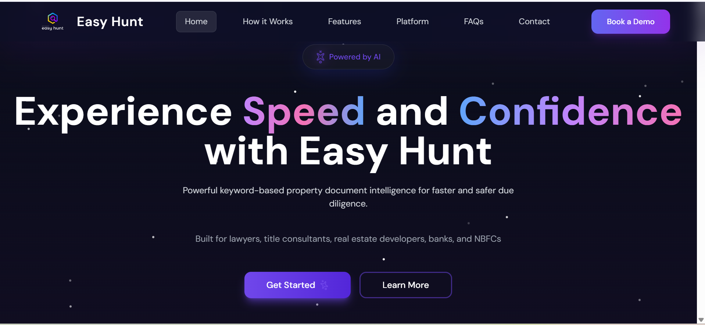

🚀 EasyHunt – Landing Page

EasyHunt is a modern and responsive landing page designed to showcase job search and career-related services. The project focuses on clean UI, smooth user experience, and fast performance.

🌐 Live Demo

👉 Live Website:
https://easy-hunt-landing-rho.vercel.app/

🛠️ Tech Stack

⚛️ React.js

🎨 CSS / Tailwind CSS

⚡ Vite

☁️ Vercel (Deployment)

📸 Preview

Add screenshots here (optional)
You can add images inside a /screenshots folder and reference them like this:

📂 Project Setup
1️⃣ Clone the repository
git clone https://github.com/your-username/easy-hunt-landing.git

2️⃣ Navigate to the project directory
cd easy-hunt-landing

3️⃣ Install dependencies
npm install

4️⃣ Run the project locally
npm run dev
<<<<<<< HEAD
=======

🚀 Deployment (Vercel)

This project is deployed using Vercel.

Steps to deploy:

Push the project to GitHub

Go to https://vercel.com

Import the GitHub repository

Select Vite / React

Click Deploy

After deployment, Vercel provides a live URL:

https://easy-hunt-landing-rho.vercel.app/

✨ Features

Responsive design

Modern UI

Fast load time

SEO-friendly layout

Mobile & desktop compatible
>>>>>>> ad54611 (update)
